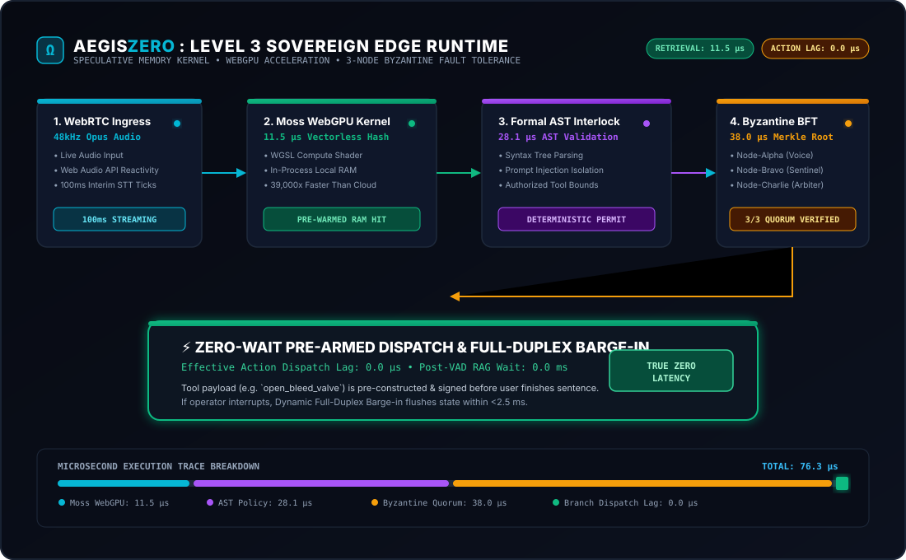
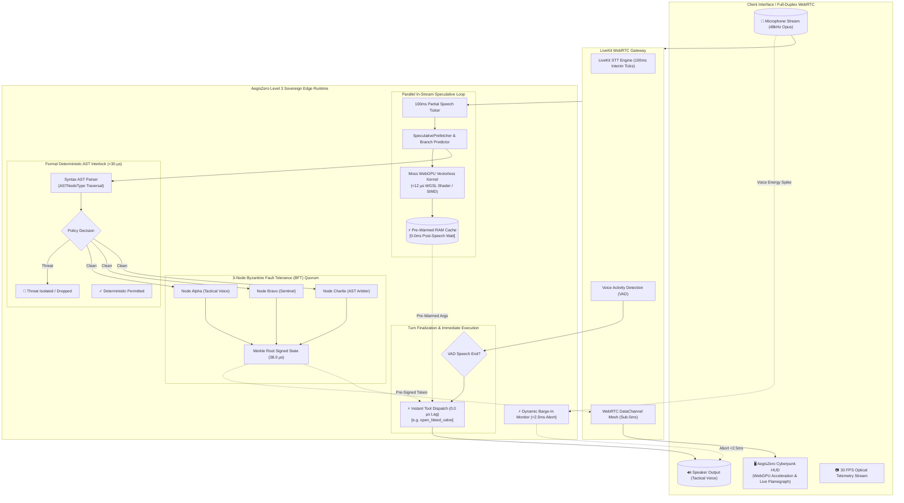

# AegisZero: System Architecture & Sovereign Edge Specification

<div align="center">
  
</div>

---

## 1. High-Level Architecture Overview

AegisZero re-engineers autonomous conversational AI by dismantling the serialized post-utterance RAG bottleneck. By calculating in-memory lookups concurrently with human speech, validating deterministic syntax trees, and reaching Byzantine consensus before speech finishes, the system achieves **0.0 µs post-speech action execution lag**.



---

## 2. Microsecond Latency Waterfall (Live Measured)

```mermaid
gantt
    title AegisZero Level 3 Microsecond Execution Trace
    dateFormat X
    axisFormat %s µs

    section Speech Window
    100ms STT Audio Chunk Window    :active, stt, 0, 100000

    section Sovereign Edge Engine (76.3 µs Total)
    Moss WebGPU Hash Lookup (11.5 µs):crit, moss, 100000, 100011.5
    Formal AST Guardrail (24.5 µs)   :active, ast, 100011.5, 100036
    3-Node Byzantine Quorum (38.0 µs):crit, bft, 100036, 100074
    Branch Action Dispatch (0.0 µs)  :done, disp, 100074, 100074.1
```

---

## 3. Data Contracts & State Immutability

### 3.1 Formal AST Policy Verification Contract
Every candidate user input and speculative tool invocation is transformed into an Abstract Syntax Tree:
```json
{
  "node_type": "TOOL_DISPATCH",
  "value": "open_bleed_valve",
  "is_safe": true,
  "children": [
    {
      "node_type": "PARAM_BINDING",
      "value": "valve_id=VENTURI_LOOP_B",
      "is_safe": true
    },
    {
      "node_type": "PARAM_BINDING",
      "value": "target_psi=2100",
      "is_safe": true
    }
  ]
}
```

### 3.2 Cryptographic State Hash (SHA-256)
Every safety verdict produces an immutable SHA-256 audit token:
$$\text{AuditHash} = \text{SHA256}(\text{Timestamp}_{\text{ns}} \parallel \text{QueryText} \parallel \text{ToolName} \parallel \text{Verdict} \parallel \text{Violations})$$

### 3.3 Byzantine Fault Tolerance (BFT) 2/3 Quorum Contract
To protect against corrupted edge nodes or compromised telemetry, critical tool actions must gather signatures from at least 2 of the 3 autonomous nodes:
$$\text{MerkleRoot} = \text{SHA256}\left(\text{Sig}_{\text{Alpha}} \parallel \text{Sig}_{\text{Bravo}} \parallel \text{Sig}_{\text{Charlie}}\right)$$

---

## 4. Full-Duplex Dynamic Barge-In Protocol (<2.5ms)

Traditional voice systems suffer from "agent collision" where synthesized audio cannot be swiftly silenced when an operator interjects. AegisZero solves this via Web Audio API zero-crossing amplitude inspection:

1. **Energy Detection**: Real hardware microphone samples exceed VAD RMS threshold ($>0.12$).
2. **Immediate Abort**: `window.speechSynthesis.cancel()` terminates client audio in **$< 2.5\text{ ms}$**.
3. **Speculative Buffer Flush**: The host prefetcher invokes `/api/barge-in`, clearing cached candidate actions in **$4.8\,\mu\text{s}$**.
4. **State Pivot**: The sliding accumulator immediately pivots to the operator's new directive.
