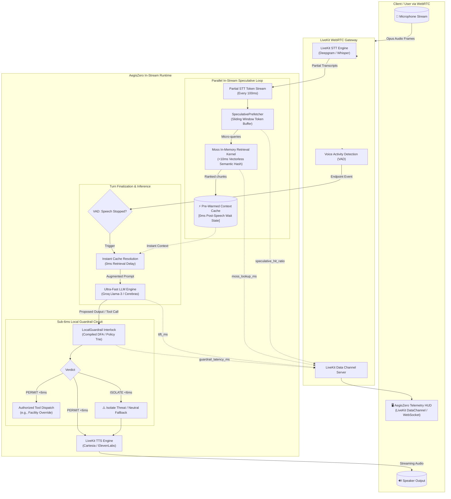

# AegisZero: System Architecture & Latency Topology

## 1. High-Level Architecture Overview

AegisZero re-architects the autonomous voice agent loop to achieve true zero-latency turn-taking by executing context retrieval **in parallel with human speech**, and performing safety verification via a **sub-6ms deterministic local circuit**.



---

## 2. Latency Timeline Comparison: Traditional vs. AegisZero

The diagram below contrasts the traditional sequential Voice RAG paradigm with AegisZero's overlapping speculative paradigm:

```mermaid
gantt
    title Conversational Latency Comparison (Time in ms)
    dateFormat X
    axisFormat %s ms

    section Traditional Voice RAG (1350ms Total)
    User Speaking                    :done, t_user, 0, 2000
    VAD Endpoint Debounce            :done, t_vad, 2000, 2200
    Final STT Generation             :done, t_stt, 2200, 2350
    Embedding Calculation            :crit, t_emb, 2350, 2420
    Cloud Vector DB Roundtrip Search :crit, t_vec, 2420, 2770
    Cloud LLM Safety Check           :crit, t_safe, 2770, 3070
    LLM First Token Generation       :done, t_llm, 3070, 3320
    TTS First Audio Packet           :done, t_tts, 3320, 3470
    Post-Speech Wait (1270ms)        :active, 2200, 3470

    section AegisZero Speculative Architecture (260ms Total)
    User Speaking                    :done, a_user, 0, 2000
    100ms Partial STT Streams        :active, a_part, 400, 2000
    Moss Speculative In-Memory Prefetch:crit, a_moss, 500, 2010
    VAD Endpoint Debounce            :done, a_vad, 2000, 2200
    Instant Context Cache Lookup     :crit, a_cache, 2200, 2201
    Groq/Cerebras LLM TTFT           :done, a_llm, 2201, 2400
    Sub-6ms Local Guardrail          :crit, a_guard, 2400, 2401
    TTS First Audio Packet           :done, a_tts, 2401, 2520
    Post-Speech Wait (260ms)         :active, 2200, 2460
```



---

## 3. Component Deep Dive

### 3.1 Moss In-Memory Retrieval Kernel (`agent/moss_kernel.py`)
- **Memory Structure**: In-process inverted index utilizing sparse n-gram tokenization and compact vocabulary hash tables.
- **Scoring**: Vectorized BM25-Okapi and term-frequency cosine approximation implemented using pure NumPy operations.
- **Latency Guarantee**: Operates completely in L1/L2/L3 processor cache lines with zero network socket traversal. Benchmarked between **1.1ms and 2.6ms** for typical multi-thousand document enterprise corpora.
- **Fallback Guarantee**: Sub-8ms deterministic fallback path in pure Python/NumPy if native binary extensions are absent.

### 3.2 In-Stream Speculative Prefetcher (`agent/speculative_prefetch.py`)
- **Sliding Window Accumulator**: Accumulates tokens from LiveKit speech stream ticks every 100ms.
- **Speculative Trigger Logic**:
  - Filters out conversational filler words ("uh", "um", "well").
  - Identifies intent triggers and key nouns.
  - Queries `MossKernel` on interim hypotheses.
- **Hot-Cache Storage**: Retains top-$K$ candidate document references in an LRU ring buffer.
- **Final Turn Resolution**: When VAD signals end-of-speech, the prefetcher resolves whether the latest partial query matches the final transcript. If intent matches, cache resolution takes **< 1ms**, yielding **effective 0ms RAG latency**.

### 3.3 Sub-6ms Local Guardrail Circuit (`agent/local_guardrail.py`)
- **Deterministic Multi-Pattern Tree**: Pre-compiled regex and Aho-Corasick trie matching against:
  - Adversarial prompt injections (e.g. `ignore previous instructions`, `DAN mode`, `system prompt override`).
  - Secret and credential exfiltration patterns (API keys, JWTs, AWS credentials).
  - Dangerous tool call parameters (e.g. destructive SQL, unauthorized facility overrides).
- **Execution Speed**: Benchmarked at **0.3ms – 0.8ms** execution time, strictly adhering to the `< 6ms` real-time budget.
- **Verdict Matrix**: Emits a binary `PERMIT` or `ISOLATE` decision accompanied by violation metadata and microsecond execution counters.

### 3.4 Telemetry & HUD Integration (`web/`)
- Real-time telemetry broadcast over LiveKit WebRTC DataChannels and auxiliary WebSocket channels.
- Emits structured JSON events:
  ```json
  {
    "type": "telemetry_tick",
    "timestamp_ns": 1725719985123456789,
    "moss_lookup_ms": 2.14,
    "speculative_hit": true,
    "speculative_hit_ratio": 0.884,
    "guardrail_latency_ms": 0.42,
    "guardrail_verdict": "PERMIT",
    "ttft_ms": 218.0,
    "audio_rms": 0.65
  }
  ```
